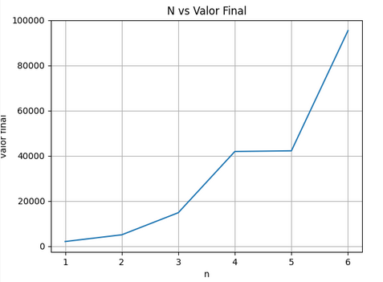

# Exámen Final Taller de Matemática 1 🥇 🔢 🔤
## Estuardo Sebastián Valle Bances - 202001954 
El presente repositorio alberga algunos de los programas utilizados para el exámen final de Taller de Matemática 1. En su mayoría problemas de "Combinatoria". Así fue la ayuda de algunas herramientas de programación para la verificación de incisos. etc

## Problema 2: Calcular $10 \overline{C} 6$ utilizando moldes 🔤
En primera instancia, sería útil listar algunas de las variables que pueden cambiar. 
Prácticamente tenemos 6 espacios en los cuales pueden existir moldes. Para esto, utilizaremos las variables $x,y,z,w,v,h$

_ _ _ _ _ _

$$
\underline{x} \hspace{0.2cm} \underline{x} \hspace{0.2cm}  \underline{x} \hspace{0.2cm} \underline{x} \hspace{0.2cm} \underline{x} \hspace{0.2cm} \underline{x}
$$

Mientras que algunos métodos fueron explicados en las hojas del exámen. En esta pequeña sección trataremos de averiguar el valor final con algunos métodos computacionales con el propósito de a) Probar que el poder computacional es demasiado y b) Tratar de comparar los valores finales. 

### Método 1: Fuerza Bruta 💥
Cómo lo dice el título de este método, iteraremos sobre todas las posibles palabras que pueden ser formadas. Éste constará de los siguientes pasos: 
- *Método*
1. Creamos un conjunto y una lista de palabras que se crearán a partir de este mismo


A = \{ a, b, c, d, e, f, g, h, i, j \} 


```python
# Conjunto
    A = ["a", "b", "c", "d", "e", "f", "g", "h", "i", "j"]
    palabras = []
    palabra = ""
```
3. Crear una palabra 
```python
#Generamos una palabra al azar
        for i in range(6):
            palabra += A[random.randint(0, i)]
```

4.  Preguntamos ¿Ésta palabra ya fue escrita antes?
Si la palabra fue escrita entonces la añadimos a un listado de palabras, si no, solamente pasamos a la siguiente 
y tomamos en cuenta que hubo una comparación. (Nota: La cantidad máxima de elementos de una lista en python es 536870912)
```python
# Si la palabra no fue generada antes entonces la añadimos
        if palabra not in palabras:
            palabras.append(palabra)
            print(palabra)
            # Puesto que añadimos una nueva palabra, la contamos
            contadorGeneral += 1

            #Reset palabra
            palabra = ""
        else:
            palabra = ""
            comparacionesRepetidas += 1
```

5. Realizamos todo lo anterior en un ciclo que se termine hasta un número a de veces. En este caso, se hizo dependiente el ciclo de la cantidad de comparaciones Repetidas. Si hubo una cantidad alta de palabras que ya fueron escritas, entonces es probable que ya se hayan agotado los casos. 

En el caso


$$
\underline{x} \hspace{0.2cm} \underline{y} \hspace{0.2cm}  \underline{z} \hspace{0.2cm} \underline{w} \hspace{0.2cm} \underline{v} \hspace{0.2cm} \underline{h}
$$

     
Para $x,y,z,w,v,h$ las variables pueden tomar 10 x 9 x 8 x 7 x 6 x 5 valores distintos, así que utilizaremos 151200 (Que es menor que 536870912) Cómo valor para detener el ciclo. 
```python
while (counter <= a):
        for i in range(6):
            palabra += A[random.randint(0,6)]
        if palabra not in palabras:
            palabras.append(palabra)
            print(palabra)
            contadorGeneral += 1
            palabra = ""
        else:
            palabra = ""
            counter += 1
    print("--- Iteraciones Terminadas -----")
    print(contadorGeneral)
``` 
Computacionalmente hablando, ésto es horrible para optimizar un programa. 💀 Ese exactamente el cometido de éste programa: Morir en el intento 🏴

Veamos algunos valores iniciales con $a = 10^n$

|   n   | 10^n | tiempo | valor final |
|-------|------|--------|-------------|
|   1   |  10  |   1s   |    2022     |
|   2   | 100  |   1s  |    4995    |
|   3   | 1000 |   3s  |  14780    |
|   4   | 10000 |   18s  |  41888    |
|   5   | 100000 |   30s  |  42179    |
|   6   | 1000000 |   115s  |  95390   |



## Problema 3: Escribir un programa que reciba $a > 1$ y produzca los primeros 3 pseudo-primos $n > 1$ en la base a. Correrlo con $a = 2$. 🔤
Para este problema, apoyado del diagrama de flujo anteriormente en las hojas. Podemos realizar de manera iterativa los calculos en Wolfram Matematica. 

Básicamente, se resume en realizar los siguientes pasos. 

- *Método Exhaustivo*
1. Pedir ingreso de variable a 
```wolfram
a = ToExpression[InputString["Ingrese el numero base"]]
n = 1
counter = 0
``` 

3. Cálculo de
 
$$
a^n - a
$$
```wolfram
While[counter <= 3,
    x = a^n - a
    If[Mod[x, n] == 0,
      counter += 1;
      Print[x],
      n += 1
    ]
``` 
con n = 1

3. Verificar divisibilidad 
Si si es divisible, entonces se debe guardar el valor y debemos contar que se encontró. 
```wolfram
While[counter <= 3,
    x = a^n - a
    If[Mod[x, n] == 0,
      counter += 1;
      Print[x],
      n += 1
    ]
``` 
Entonces, tenemos un resultado final del programa cómo: 
a = ToExpression[InputString["Ingrese el numero base"]]
n = 1
counter = 0
```wolfram
If[a > 1,
  While[counter <= 3,
    x = a^n - a
    If[Mod[x, n] == 0,
      counter += 1;
      Print[x],
      n += 1
    ]
  ]
]
``` 
*Prueba para a = 2* 
Estos son los valores proporcionados en consola luego de realizar la operación. 
